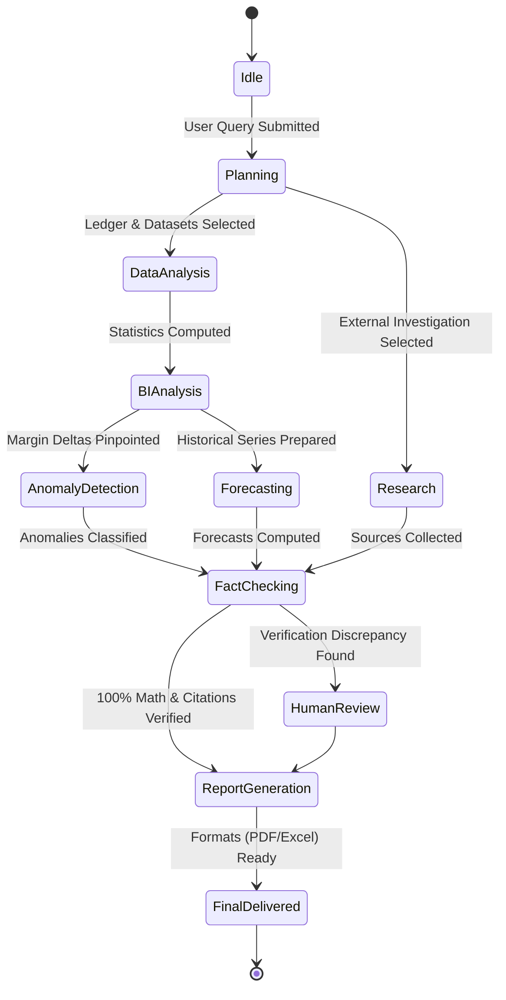

# Agent Workflow & State Machine

AgentBI implements a state-based workflow orchestrator where execution graphs are dynamically planned by the Supervisor Agent and executed with deterministic state handoffs.

## Workflow State Lifecycle



## State Definition (`AgentState`)

```python
class AgentState(BaseModel):
    user_id: str
    task_id: str
    original_query: str
    plan: List[str]
    documents: List[Dict[str, Any]]
    datasets: List[Dict[str, Any]]
    research_results: List[Dict[str, Any]]
    analysis_results: Dict[str, Any]
    forecasts: Dict[str, Any]
    anomalies: List[Dict[str, Any]]
    insights: List[str]
    verification_results: List[Dict[str, Any]]
    final_report: Dict[str, Any]
    errors: List[str]
    step_history: List[Dict[str, Any]]
    total_tokens: int
    total_duration_ms: int
```

## Fault Tolerance & Safe Summaries

- **Timeouts**: Individual agent steps time out after 30 seconds to prevent blocking.
- **Fail-Soft Degradation**: If an optional research agent fails, the analytical core still completes with flagged uncertainty.
- **Zero Raw Chain-of-Thought**: To preserve privacy and prevent leakage of internal prompt reasoning, only safe, sanitized summaries are exposed to the user interface and audit logs.
