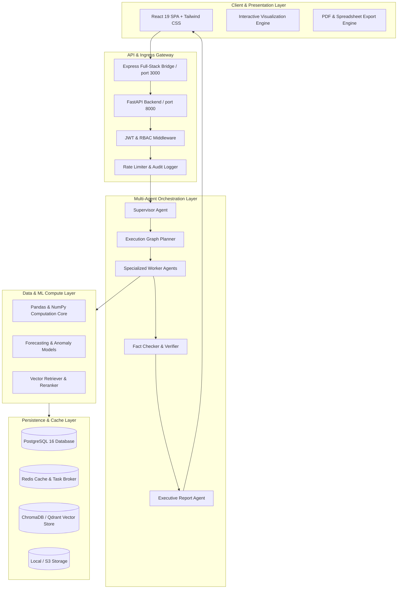

# System Architecture

The AgentBI platform is built upon a layered micro-modular architecture designed for enterprise scalability, verifiable mathematical integrity, and autonomous multi-agent execution.

## Architectural Layers

## Core Architectural Principles

1. **Deterministic Calculation Isolation**: Large Language Models never compute arithmetic or financial sums directly. All calculations are executed by verified Python tool modules (`CalculatorTool`, `PythonAnalysisTool`, `MLForecaster`).
2. **Strict Agent State Encapsulation**: Agents mutate an immutable `AgentState` object passing inputs, outputs, duration timestamps, and token counts.
3. **Pluggable AI & Vector Providers**: Unified provider abstractions decouple the system from proprietary LLM vendors. Switching between Gemini, OpenAI, or self-hosted models requires zero codebase rewrites.
4. **Auditability & Zero Fabricated Facts**: Every metric presented in executive reports links back to a ledger transaction, calculation hash, or document vector citation.
