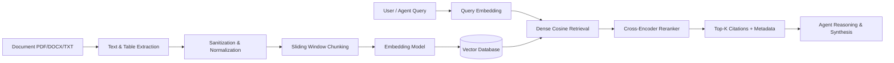

# Retrieval-Augmented Generation (RAG) Architecture

AgentBI incorporates an enterprise-grade RAG pipeline enabling autonomous agents to ground their reasoning in proprietary corporate memos, financial filings, contracts, and transcripts.

## Ingestion & Retrieval Pipeline

## Vector Store Abstraction

The vector layer is abstracted via a common interface, supporting:
- **ChromaDB**: Lightweight in-process or local client storage for development and edge environments.
- **Qdrant**: High-throughput distributed vector search engine for cloud production clusters.

## Chunking & Grounding Strategy

- **Chunk Size**: 400 words with 50-word sliding window overlap.
- **Metadata**: Each chunk stores `document_id`, `filename`, `page_number`, `token_count`, and `created_at`.
- **Citations**: Citations must accompany every claim retrieved from documents, displaying document title, page number, and similarity score.
